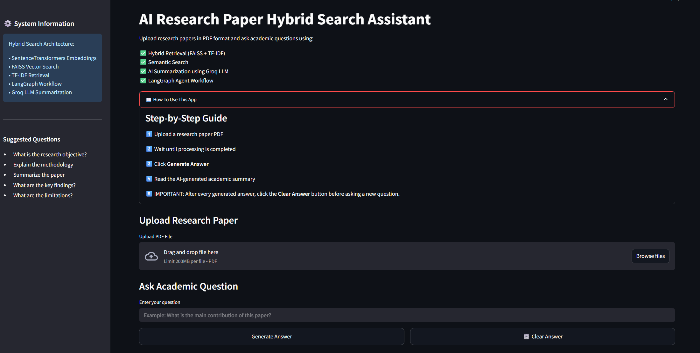
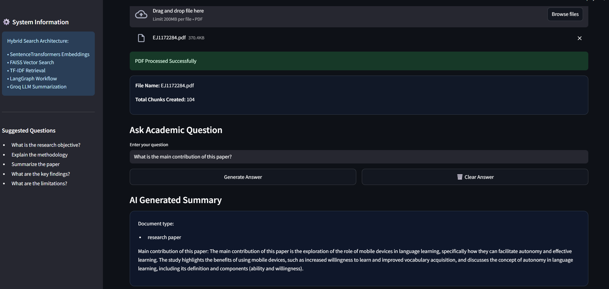

# **AI Research Paper Hybrid Search Assistant**

An AI-powered research paper analysis system built with Streamlit, FastAPI, LangGraph, FAISS, and Groq LLMs that allows users to interact with academic PDFs using natural language.

This project combines semantic vector retrieval and TF-IDF keyword search to generate context-aware answers from research papers and technical documents using a Hybrid Retrieval-Augmented Generation (RAG) pipeline.

---



---

## **AI Research Paper Hybrid Search Assistant enables users to:**

-Upload research papers in PDF format

-Ask natural language questions about academic documents

-Retrieve relevant research content using hybrid search

-Generate AI-powered summaries and explanations

-Understand methodologies and key contributions

-Simplify complex academic language

-Interact through a modern Streamlit-based UI

The application uses FAISS semantic retrieval, TF-IDF keyword ranking, LangGraph workflows, and Groq LLMs for intelligent academic document understanding.

---



---

## **Features**

### **AI-Powered Research Understanding**

-The AI analyzes uploaded research papers using semantic retrieval and LLM reasoning.

-Hybrid Retrieval System

-Uses semantic vector search with FAISS

-Uses TF-IDF keyword search

-Combines both retrieval methods for improved accuracy

---

### **PDF Research Paper Processing**

-Extracts text from academic PDFs

-Chunks large documents intelligently

-Processes technical and research documents efficiently

-Supports long-form document understanding

---

### **Research Assistance**

-Generates research summaries

-Explains methodologies

-Identifies key findings and contributions

-Simplifies academic language for easier understanding

---

### **Interactive Document Chat**

-Users can ask natural language questions

-Provides context-aware AI responses

-Displays accurate document-based answers

-Modern chat-style research interaction

---


---

## **Only safe document operations are allowed.**

-The system only reads uploaded PDF documents.

-The application does NOT:

-Modify uploaded files

-Execute scripts from documents

-Run unsafe operations

-Store sensitive credentials permanently

---

## **Hybrid Search Architecture**

The system combines:

-Semantic Embedding Search

-TF-IDF Keyword Retrieval

-FAISS Vector Database

-LangGraph Workflow Orchestration

-Groq LLM Answer Generation

This improves retrieval quality and reduces hallucinated answers.

---

## **Supported Inputs**

-PDF Research Papers

-Academic Journals

-Technical Reports

-Government Documents

-Financial Documents

---

## **Example Use Cases**

-Research paper understanding

-Academic literature review

-Technical document analysis

-Financial bill summarization

-Government policy exploration

-Student research assistance

---

## **Example Queries**

```text
What is the main contribution of this paper?
```

```text
Summarize the methodology used in this research.
```

```text
Explain the findings in simple terms.
```

```text
What algorithms are discussed in this paper?
```

```text
What are the limitations mentioned in the paper?
```

---

## **Tech Stack**

### **Frontend**

-Streamlit

---

### **Backend**

-FastAPI

-Python

---

### **AI / LLM**

-Groq LLM

-LangChain

-LangGraph

---

### **Embeddings**

-Sentence Transformers

-HuggingFace Transformers

---

### **Vector Database**

-FAISS

---

### **Hybrid Search**

-TF-IDF

-Scikit-learn

---

### **PDF Processing**

-PyMuPDF

---

## **System Workflow**

```text
Upload PDF
   ↓
Extract Text from PDF
   ↓
Chunk Document
   ↓
Generate Embeddings
   ↓
Store in FAISS
   ↓
Create TF-IDF Index
   ↓
User Question
   ↓
Hybrid Retrieval
(Semantic + Keyword)
   ↓
Retrieve Relevant Context
   ↓
Generate AI Response
```

---

## **Installation**

### **Clone Repository**

```bash
git clone <YOUR_GITHUB_REPOSITORY_LINK>
cd AI-Research-Paper-Hybrid-Search-Assistant
```

---

### **Create Virtual Environment**

```bash
python -m venv venv
```

---

### **Activate Environment**

#### **Windows**

```bash
venv\Scripts\activate
```

#### **Linux / Mac**

```bash
source venv/bin/activate
```

---

### **Install Dependencies**

```bash
pip install -r requirements.txt
```

---

### **Create .env File**

```env
GROQ_API_KEY=your_groq_api_key
MODEL_NAME=llama-3.1-8b-instant
```

---

### **Run Backend**

```bash
uvicorn app.main:app --reload
```

---

### **Run Frontend**

```bash
streamlit run frontend/streamlit_app.py
```

---

## **Limitations**

-Large PDFs may increase processing time

-OCR-scanned PDFs may reduce extraction quality

-Retrieval accuracy depends on chunking quality

-Complex research domains may require improved prompts

---

## **Future Improvements**

-Multi-PDF support

-Citation-aware answers

-PDF highlighting for retrieved sections

-Chat history memory

-Research paper recommendation system

-GPU-optimized embedding generation

-Multi-user support

---

## **Output Principle**

The system strictly answers using retrieved document context.

If information is not found in the uploaded document, the assistant clearly states that instead of generating unsupported answers.

---

## **Deployment**

### **Frontend Deployment**

-Streamlit Cloud

-Hugging Face Spaces

---

### **Backend Deployment**

-Render

-Railway

-Docker

---

[Live Demo](https://2swuk2ttqouyhqfqs8tatu.streamlit.app/)

-Academic assistance

-Context-aware summarization

---
